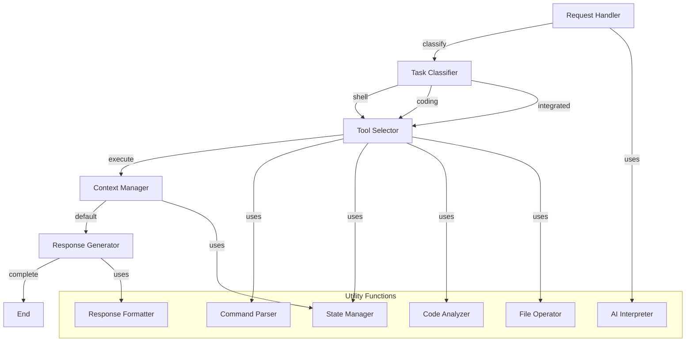

# AI Shell and Coding Agent

An intelligent agent that seamlessly handles both coding and shell operations through natural language commands, built using the [PocketFlow](https://github.com/The-Pocket/PocketFlow) framework.

## Overview

This agent is designed to be your AI pair programming assistant, capable of:
- Understanding and executing natural language coding requests
- Managing shell operations with proper validation
- Maintaining context across multiple operations
- Performing complex code analysis and modifications

## Features

### Coding Capabilities
- **Code Search**: Search codebases using semantic understanding or patterns
- **Code Analysis**: Understand code structure and dependencies
- **Code Editing**: Make changes while preserving style and context
- **Testing Support**: Help with test creation and verification

### Shell Capabilities
- **Command Execution**: Run shell commands with state management
- **File Operations**: Handle file system tasks safely
- **Script Generation**: Create and execute automation scripts
- **Environment Management**: Track and modify system state

### AI Features
- **Natural Language Understanding**: Convert requests to actions
- **Context Awareness**: Remember previous operations
- **Safety Checks**: Validate all operations before execution
- **Smart Suggestions**: Provide intelligent recommendations

## Architecture

### Flow Design


### Core Components

#### 1. Node System
Each operation is handled by specialized nodes:

- **RequestHandlerNode**: Processes natural language requests
- **TaskClassifierNode**: Determines if task is coding, shell, or both
- **ToolSelectorNode**: Picks appropriate tools for the task
- **ContextManagerNode**: Maintains operation history and state
- **ResponseGeneratorNode**: Formats and returns results

#### 2. State Management
```python
@dataclass
class SharedState:
    request: Dict[str, Any]  # Current request info
    task: Dict[str, Any]     # Task classification
    context: Dict[str, Any]  # Environment state
    result: Dict[str, Any]   # Operation results
```

#### 3. Utility Functions
- **CommandParser**: Shell command validation
- **StateManager**: Environment state tracking
- **ResponseFormatter**: Output standardization
- **CodeAnalyzer**: Code understanding
- **FileOperator**: File system operations
- **AIInterpreter**: Natural language processing

## Usage Examples

### 1. Code Operations
```python
# Find specific code patterns
agent.process_request("find all API endpoint definitions")

# Make code changes
agent.process_request("add error handling to the file upload function")

# Code analysis
agent.process_request("explain the authentication flow in this codebase")
```

### 2. Shell Operations
```python
# File operations
agent.process_request("organize all JavaScript files into a src directory")

# System monitoring
agent.process_request("show me current memory usage")

# Environment setup
agent.process_request("set up a Python virtual environment and install requirements")
```

### 3. Integrated Tasks
```python
# Combined operations
agent.process_request("find TODOs in the codebase and create issues for each")

# Development workflow
agent.process_request("run tests, format code, and commit changes")

# Project setup
agent.process_request("initialize a new React project and set up ESLint")
```

## Getting Started

### Installation
```bash
# Clone the repository
git clone https://github.com/yourusername/ai-coding-agent.git

# Install dependencies
pip install -r requirements.txt
```

### Basic Usage
```python
from agent import ShellAgent

# Initialize the agent
agent = ShellAgent()

# Process a request
response = agent.process_request("help me understand this codebase")

# Access results
print(response.explanation)
print(response.changes)
```

### Advanced Configuration
```python
from agent import ShellAgent, TaskType, SharedState

# Configure with custom settings
agent = ShellAgent(
    working_dir="/path/to/project",
    safety_checks=True,
    verbose_logging=True
)
```

## Development

### Adding New Capabilities
```python
from agent.core import Node

class CustomAnalyzer(Node):
    def prep(self, shared):
        # Prepare analysis
        return data

    def exec(self, data):
        # Perform analysis
        return result

    def post(self, shared, data, result):
        # Update state
        return "next_node"
```

## Contributing

Contributions are welcome! Please check our [Contributing Guide](CONTRIBUTING.md).

## Credits

Built with:
- [PocketFlow](https://github.com/The-Pocket/PocketFlow) - The underlying framework
- Python 3.8+
- Modern AI/ML libraries

## License

This project is licensed under the MIT License - see the [LICENSE](LICENSE) file for details.


